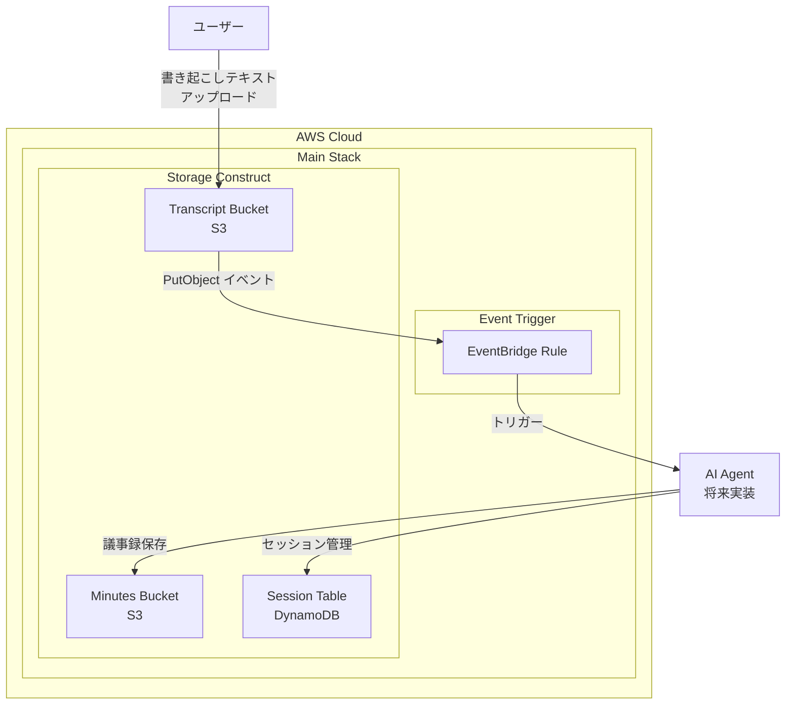

# インフラ基盤 設計

## 概要

議事録・タスク管理自動化 AI エージェントの AWS インフラストラクチャを CDK で構築する。
検証環境として一括削除可能な設計とし、L2 コンストラクトを優先的に使用する。

## アーキテクチャ



## コンポーネント

| コンポーネント    | ファイル                              | 責務                                 |
| ----------------- | ------------------------------------- | ------------------------------------ |
| CDK_App           | `bin/app.ts`                          | CDK アプリエントリーポイント         |
| Main_Stack        | `lib/stacks/main-stack.ts`            | Construct の組み立て、依存関係管理   |
| Storage_Construct | `lib/constructs/storage-construct.ts` | S3 バケット、DynamoDB テーブルの作成 |

### Storage_Construct の公開プロパティ

- `transcriptBucket: s3.Bucket` - 書き起こしファイル用
- `minutesBucket: s3.Bucket` - 議事録ファイル用
- `sessionTable: dynamodb.TableV2` - セッション管理用

## データモデル

### Session_Table スキーマ

| 属性名         | 型     | 説明                                      |
| -------------- | ------ | ----------------------------------------- |
| sessionId (PK) | String | セッションの一意識別子                    |
| status         | String | セッション状態（active/completed/failed） |
| transcriptKey  | String | 書き起こしファイルの S3 キー              |
| minutesKey     | String | 議事録ファイルの S3 キー（生成後）        |
| createdAt      | String | セッション作成日時（ISO 8601）            |
| updatedAt      | String | 最終更新日時（ISO 8601）                  |

### S3 バケット構造

- **Transcript_Bucket**: `transcripts/{year}/{month}/{sessionId}.txt`
- **Minutes_Bucket**: `minutes/{year}/{month}/{sessionId}.md`

## 正当性プロパティ

### Property 1: ストレージリソースの削除ポリシー設定

_For any_ ストレージリソース（S3 バケット、DynamoDB テーブル）において、`removalPolicy: DESTROY` が設定されていること。S3 バケットについては追加で `autoDeleteObjects: true` が設定されていること。

**Validates: Requirements 2.3, 2.5, 4.2, 4.3**

## テスト戦略

- **ユニットテスト**: Jest + aws-cdk-lib/assertions によるスナップショットテスト
- **プロパティベーステスト**: CloudFormation テンプレートを解析し、削除ポリシーを検証

### テストファイル構成

```
test/
├── main-stack.test.ts
├── constructs/
│   └── storage-construct.test.ts
└── properties/
    └── removal-policy.test.ts
```
