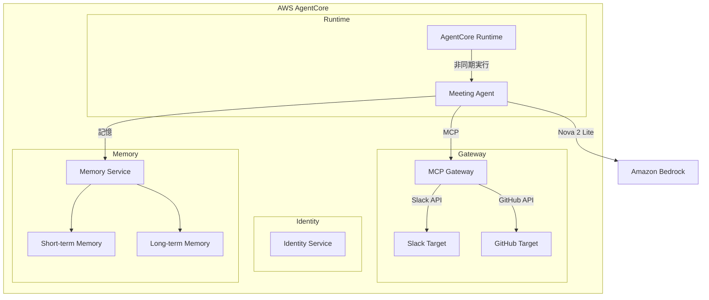

# AgentCore 設定 設計

## 概要

AWS AgentCore を活用した AI エージェント実行基盤の設計。Runtime、Gateway、Identity、Memory 機能を CDK で構築する。

### 重要な設計判断

- **インフラ層（CDK）**: TypeScript で実装
- **エージェント層**: Python + Strands Agents SDK で実装
- **デプロイ**: AgentCore CLI を使用

## アーキテクチャ



## コンポーネント

| コンポーネント         | ファイル                                          | 責務                             |
| ---------------------- | ------------------------------------------------- | -------------------------------- |
| AgentRuntime_Construct | `lib/constructs/agent/agent-runtime-construct.ts` | Runtime 用 IAM ロール作成        |
| AgentGateway_Construct | `lib/constructs/agent/agent-gateway-construct.ts` | Gateway 設定（CLI 経由デプロイ） |
| AgentMemory_Construct  | `lib/constructs/agent/agent-memory-construct.ts`  | Memory 設定（CLI 経由デプロイ）  |
| Meeting_Agent          | `agents/meeting_agent.py`                         | エージェント本体                 |

### AgentCore 設定ファイル

```yaml
# .bedrock_agentcore.yaml
agents:
  MeetingAgent:
    entrypoint: agents/meeting_agent.py
    runtime: PYTHON_3_12
    deployment_type: direct_code_deploy
    idle_timeout: 900
    max_lifetime: 28800
    memory:
      mode: STM_AND_LTM
      event_expiry_days: 90
```

## 正当性プロパティ

### Property 1: セッション状態維持

_For any_ セッション ID とユーザー入力のシーケンス、同一セッション内で行われた会話は後続のリクエストで参照可能であり、セッション状態が維持される。

**Validates: Requirements 1.2, 4.1**

### Property 2: LTM ラウンドトリップ

_For any_ 有効な知識データ、LTM に保存した後にセマンティック検索を行うと、関連性の高いクエリに対して保存した知識が取得できる。

**Validates: Requirements 4.3, 4.4**

### Property 3: ツール入力検証

_For any_ ツール定義とその入力、スキーマに違反する入力に対してはエラーが発生し、スキーマに準拠する入力に対しては正常に処理される。

**Validates: Requirements 5.1**

## エラーハンドリング

| エラー種別        | 原因                               | 対処                       |
| ----------------- | ---------------------------------- | -------------------------- |
| SessionNotFound   | 無効なセッション ID                | 新規セッションを作成       |
| ExecutionTimeout  | 8 時間超過                         | ログ出力後、セッション終了 |
| ModelAccessDenied | Bedrock モデルへのアクセス権限なし | IAM ロールの権限確認       |

## テスト戦略

- **ユニットテスト**: 設定ファイルの構文検証、CDK スナップショットテスト
- **プロパティベーステスト**: Hypothesis（Python）、最小 100 回/プロパティ

### テストファイル構成

```
tests/
├── unit/
│   └── test_agent_config.py
├── property/
│   ├── test_session_state.py      # Property 1
│   ├── test_ltm_roundtrip.py      # Property 2
│   └── test_tool_validation.py    # Property 3
└── integration/
    └── test_agent_e2e.py
```
