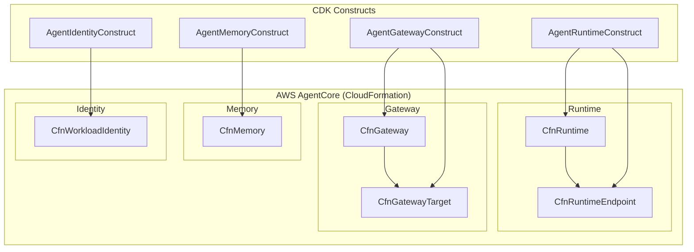

# AgentCore 設定 設計

## 概要

AWS AgentCore を活用した AI エージェント実行基盤の設計。Runtime、Gateway、Memory、WorkloadIdentity 機能を CDK の L1 リソース（CfnXxx）で構築する。

### 重要な設計判断

- **インフラ層（CDK）**: TypeScript で実装、L1 リソース（CfnXxx）を使用
- **エージェント層**: Python + Strands Agents SDK で実装
- **デプロイ**: CDK deploy で CloudFormation 経由でデプロイ（CLI 不要）

## アーキテクチャ



## コンポーネント

| コンポーネント          | ファイル                                           | 責務                                         |
| ----------------------- | -------------------------------------------------- | -------------------------------------------- |
| AgentRuntime_Construct  | `lib/constructs/agent/agent-runtime-construct.ts`  | CfnRuntime + CfnRuntimeEndpoint + IAM ロール |
| AgentGateway_Construct  | `lib/constructs/agent/agent-gateway-construct.ts`  | CfnGateway + CfnGatewayTarget                |
| AgentMemory_Construct   | `lib/constructs/agent/agent-memory-construct.ts`   | CfnMemory                                    |
| AgentIdentity_Construct | `lib/constructs/agent/agent-identity-construct.ts` | CfnWorkloadIdentity                          |
| Meeting_Agent           | `agents/meeting_agent.py`                          | エージェント本体（Strands Agents）           |

## 正当性プロパティ

_A property is a characteristic or behavior that should hold true across all valid executions of a system-essentially, a formal statement about what the system should do. Properties serve as the bridge between human-readable specifications and machine-verifiable correctness guarantees._

### Property 1: Runtime リソース作成の整合性

_For any_ 有効な Runtime 設定、CDK synth を実行すると、必須プロパティ（AgentRuntimeName、AgentRuntimeArtifact、RoleArn、NetworkConfiguration）を含む CloudFormation テンプレートが生成される。

**Validates: Requirements 1.1, 1.2, 1.3**

### Property 2: Gateway リソース作成の整合性

_For any_ 有効な Gateway 設定、CDK synth を実行すると、必須プロパティ（Name、AuthorizerType）を含む CloudFormation テンプレートが生成される。

**Validates: Requirements 2.1, 2.2**

### Property 3: Memory EventExpiryDuration の範囲検証

_For any_ Memory 設定、EventExpiryDuration は 7 以上 365 以下の整数でなければならない。範囲外の値を指定した場合、バリデーションエラーが発生する。

**Validates: Requirements 3.2**

### Property 4: IAM ロール信頼関係の整合性

_For any_ AgentCore 用 IAM ロール、信頼ポリシーは bedrock-agentcore.amazonaws.com を含む。

**Validates: Requirements 6.3**

## エラーハンドリング

| エラー種別                | 原因                               | 対処                                  |
| ------------------------- | ---------------------------------- | ------------------------------------- |
| InvalidParameterValue     | 必須プロパティの欠落または無効な値 | CloudFormation エラーメッセージを確認 |
| ResourceNotFoundException | 参照先リソースが存在しない         | 依存関係を確認                        |
| AccessDeniedException     | IAM 権限不足                       | IAM ロールの権限を確認                |
| ValidationException       | EventExpiryDuration が範囲外       | 7-365 の範囲内に設定                  |

## テスト戦略

- **ユニットテスト**: CDK スナップショットテスト（TypeScript）
- **プロパティベーステスト**: Hypothesis（Python）、最小 100 回/プロパティ

### テストファイル構成

```
test/
├── agent-runtime-construct.test.ts    # Runtime Construct テスト
├── agent-gateway-construct.test.ts    # Gateway Construct テスト
├── agent-memory-construct.test.ts     # Memory Construct テスト
└── agent-identity-construct.test.ts   # Identity Construct テスト

agents/tests/
├── property/
│   ├── test_memory_config.py          # Property 3
│   └── test_tool_validation.py        # ツール入力検証
└── unit/
    └── test_agent_config.py
```
