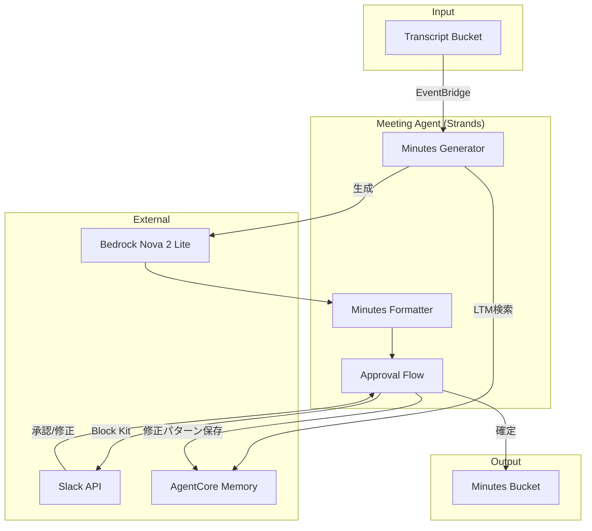

# 議事録生成機能 設計

## 概要

会議の書き起こしテキストから議事録を自動生成する機能。Strands Agents SDK + Amazon Bedrock（Nova 2 Lite）で議事録を生成し、AgentCore Memory で修正パターンを学習、Slack 承認フローを経て S3 に保存する。

## アーキテクチャ



## コンポーネント

| コンポーネント    | ファイル                        | 責務                          |
| ----------------- | ------------------------------- | ----------------------------- |
| Minutes_Generator | `agents/tools/summarize.py`     | 書き起こしから議事録生成      |
| Minutes_Formatter | `agents/tools/formatter.py`     | Markdown 変換、ファイル名生成 |
| Approval_Flow     | `agents/tools/approval_flow.py` | Slack 承認フロー管理          |

## データモデル

### Minutes（議事録）

```python
class Minutes(BaseModel):
    title: str                    # 会議タイトル
    date: datetime                # 会議日時
    participants: List[str]       # 参加者リスト
    agenda: List[str]             # 議題リスト
    discussion: str               # 議論内容
    decisions: List[str]          # 決定事項リスト
    action_items: List[ActionItem]  # アクションアイテム

class ActionItem(BaseModel):
    description: str              # タスクの説明
    assignee: Optional[str]       # 担当者
    due_date: Optional[str]       # 期限
    completed: bool = False       # 完了フラグ
```

### 承認待ちデータの永続化

| データ種別           | 保存先                 | 理由                                    |
| -------------------- | ---------------------- | --------------------------------------- |
| 議事録本体（JSON）   | AgentCore Memory STM   | セッション単位で管理、90 日自動期限切れ |
| 承認状態・メタデータ | DynamoDB Session_Table | 高速なステータス検索                    |
| 修正パターン         | AgentCore Memory LTM   | セマンティック検索で類似パターンを取得  |

## 正当性プロパティ

### Property 1: UTF-8 エンコーディングの保持

_任意の_ UTF-8 文字列に対して、読み込み処理を行った後も元の文字列と同一の内容が取得できる。
**Validates: Requirements 1.2**

### Property 2: ファイルサイズ検証

_任意の_ ファイルに対して、サイズが 1MB 以下の場合は検証が成功し、1MB を超える場合は検証が失敗する。
**Validates: Requirements 1.4, 1.5**

### Property 3: 議事録構造の完全性

_任意の_ 生成された議事録に対して、必須フィールド（title, date, discussion）が存在する。
**Validates: Requirements 2.2, 2.5**

### Property 4: Markdown ラウンドトリップ

_任意の_ 有効な Minutes オブジェクトに対して、`from_markdown(to_markdown(minutes))` が元のオブジェクトと同等の構造を持つ。
**Validates: Requirements 3.4, 5.4**

### Property 5: Markdown 見出し構造

_任意の_ 生成された Markdown に対して、H1 見出しが 1 つ存在し、H2 見出しが適切なセクションに対応する。
**Validates: Requirements 3.1, 3.2**

### Property 6: アクションアイテムのチェックボックス形式

_任意の_ アクションアイテムを含む議事録に対して、`- [ ]` または `- [x]` 形式で出力される。
**Validates: Requirements 3.3**

### Property 7: Block Kit 構造の妥当性

_任意の_ 議事録と session_id に対して、生成された Block Kit JSON は必須フィールドを含む。
**Validates: Requirements 4.2**

### Property 8: 承認フロー状態遷移

_任意の_ 承認アクションに対して、approve は APPROVED 状態を、request_revision は REVISION_REQUESTED 状態を返す。
**Validates: Requirements 4.3, 4.4**

### Property 9: ファイル名形式

_任意の_ 議事録に対して、生成されるファイル名は `{YYYY-MM-DD}_{title-slug}.md` 形式に従う。
**Validates: Requirements 5.2**

### Property 10: リトライ動作

_任意の_ 失敗する操作に対して、最大 3 回のリトライが行われ、指数バックオフが適用される。
**Validates: Requirements 6.1**

### Property 11: 承認待ち議事録の永続化

_任意の_ 承認待ち状態の議事録に対して、Memory に議事録本体が保存され、DynamoDB にメタデータが保存される。
**Validates: Requirements 4.3, 4.4, 7.5**

### Property 12: 承認待ち議事録の復元

_任意の_ session_id に対して、保存された承認待ち議事録を取得した場合、元の議事録と同等の構造が復元される。
**Validates: Requirements 4.3, 4.4**

## エラーハンドリング

| エラー種別         | 対応                           | リトライ  |
| ------------------ | ------------------------------ | --------- |
| 空ファイル         | ValidationError を返す         | なし      |
| サイズ超過         | ValidationError を返す         | なし      |
| Bedrock API エラー | リトライ後 Slack 通知          | 最大 3 回 |
| S3 保存エラー      | 一時ストレージに保存しリトライ | 最大 3 回 |
| Slack API エラー   | ログ記録、処理継続             | 最大 3 回 |

## テスト戦略

- **ユニットテスト**: Formatter、Validator、ApprovalFlow のロジック検証
- **プロパティベーステスト**: Hypothesis（Python）、最小 100 回/プロパティ

### テストファイル構成

```
tests/
├── unit/
│   ├── test_formatter.py
│   ├── test_validator.py
│   └── test_approval_flow.py
├── property/
│   ├── test_utf8_encoding.py       # Property 1
│   ├── test_file_size.py           # Property 2
│   ├── test_markdown_roundtrip.py  # Property 4
│   ├── test_block_kit.py           # Property 7
│   └── test_persistence.py         # Property 11, 12
└── integration/
    └── test_minutes_e2e.py
```
