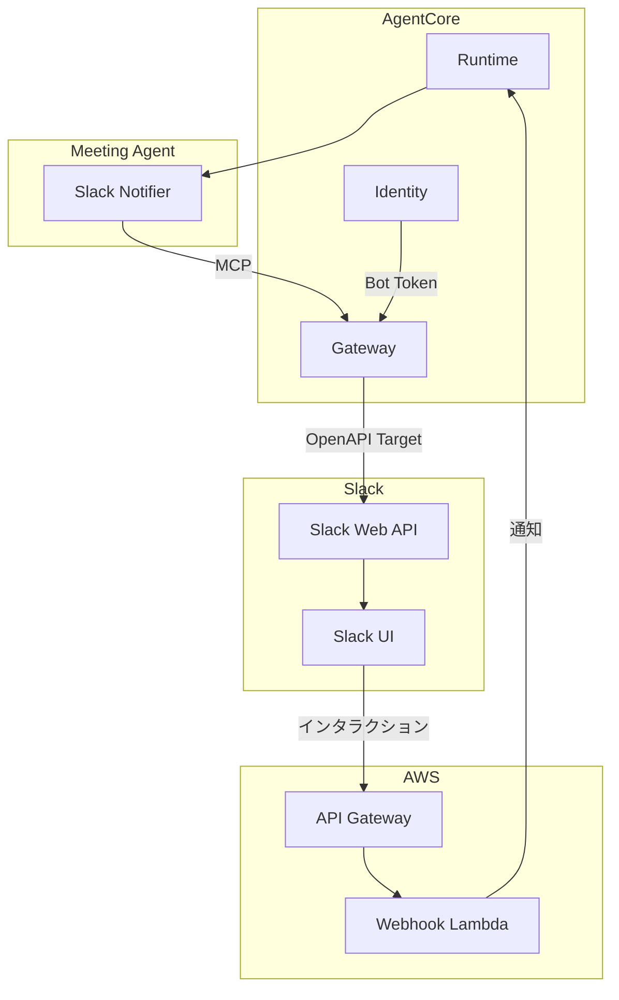

# Slack 連携機能 設計

## 概要

AgentCore Gateway 経由で Slack Web API に接続し、Block Kit を使用したインタラクティブな承認フローを実現する。Slack からのインタラクションは Lambda + API Gateway で受信し、AgentCore Runtime に通知する。

## アーキテクチャ



### Lambda が必要な理由

1. Slack は設定した URL に POST リクエストを送信し、3 秒以内の応答を期待
2. Slack Signing Secret を使用した署名検証が必須
3. AgentCore Runtime の `/invocations` は AWS 認証（SigV4）を使用するため、Slack から直接呼び出せない

## コンポーネント

| コンポーネント    | ファイル                                         | 責務                      |
| ----------------- | ------------------------------------------------ | ------------------------- |
| Slack_Notifier    | `agents/tools/slack_notifier.py`                 | Slack へのメッセージ送信  |
| Block_Kit_Builder | `agents/tools/block_kit_builder.py`              | Block Kit メッセージ構築  |
| Slack_Handler     | `agents/tools/slack_handler.py`                  | インタラクション処理      |
| Webhook_Lambda    | `lambda/slack-webhook/handler.ts`                | 署名検証 + Runtime 転送   |
| Slack_Construct   | `lib/constructs/notification/slack-construct.ts` | Lambda + API Gateway 作成 |

### Block_Kit_Builder の主要メソッド

| メソッド                    | 用途                         |
| --------------------------- | ---------------------------- |
| `create_approval_message`   | 承認メッセージ生成           |
| `create_feedback_modal`     | 修正フィードバック用モーダル |
| `create_status_message`     | ステータス更新メッセージ     |
| `create_reminder_message`   | リマインダーメッセージ       |
| `create_error_notification` | エラー通知メッセージ         |

### Slack_Handler の主要メソッド

| メソッド                 | 用途                   |
| ------------------------ | ---------------------- |
| `verify_signature`       | Slack 署名検証         |
| `parse_interaction`      | ペイロードパース       |
| `handle_block_action`    | ブロックアクション処理 |
| `handle_view_submission` | ビュー送信処理         |

## データモデル

### SlackMessageRecord（DynamoDB）

| 属性名         | 型     | 説明                          |
| -------------- | ------ | ----------------------------- |
| session_id     | String | セッション ID（PK）           |
| channel_id     | String | チャンネル ID                 |
| message_ts     | String | メッセージタイムスタンプ      |
| status         | String | pending/approved/cancelled 等 |
| content_type   | String | minutes/tasks                 |
| reminder_count | Number | リマインダー送信回数          |

### Gateway Target 設定

- **OpenAPI スキーマ**: `chat.postMessage`, `chat.update`, `views.open` を定義
- **認証**: `Authorization: Bearer ${SLACK_BOT_TOKEN}` ヘッダー

## 正当性プロパティ

### Property 1: Block Kit ラウンドトリップ

_For any_ 有効な承認メッセージパラメータに対して、生成した Block Kit JSON を `parse_blocks()` でパースし、`validate_blocks()` で検証した場合、検証が成功する。
**Validates: Requirements 2.6**

### Property 2: 文字数制限の遵守

_For any_ 任意の長さのコンテンツに対して、生成されたメッセージのテキスト部分は 3000 文字以下である。
**Validates: Requirements 2.5**

### Property 3: 承認メッセージの構造

_For any_ 有効なパラメータに対して、生成された Block Kit JSON は header, section, actions ブロックを含み、「承認」「修正」「キャンセル」の 3 つのボタンが存在する。
**Validates: Requirements 2.2, 2.3, 2.4**

### Property 4: 署名検証の正確性

_For any_ 有効な Slack リクエストに対して、`verify_signature()` は正しい署名の場合に True を返し、不正な署名の場合に False を返す。
**Validates: Requirements 9.2, 9.3**

### Property 5: タイムスタンプ検証

_For any_ タイムスタンプに対して、現在時刻から 5 分以上離れている場合、`verify_signature()` は False を返す。
**Validates: Requirements 9.2**

### Property 6: アクション処理の状態遷移

_For any_ ブロックアクションペイロードに対して、`handle_block_action()` は action_id に応じて正しい ActionType を返す。
**Validates: Requirements 3.1, 3.2, 3.3**

### Property 7: 空の修正内容の拒否

_For any_ 空または空白のみの修正テキストを含むビュー送信ペイロードに対して、`handle_view_submission()` は ValueError を発生させる。
**Validates: Requirements 4.5**

### Property 8: ステータス更新メッセージの構造

_For any_ 元のブロックとステータスに対して、生成されたメッセージは actions ブロックを含まず、context ブロックにステータスを含む。
**Validates: Requirements 5.1, 5.2, 5.3, 5.4**

### Property 9: リマインダーメッセージの構造

_For any_ 有効なパラメータに対して、生成されたメッセージは元のメッセージへのリンクを含む。
**Validates: Requirements 6.4**

### Property 10: モーダルの構造

_For any_ session_id と content_type に対して、生成されたモーダルは input ブロック、submit ボタン、close ボタンを含む。
**Validates: Requirements 4.1, 4.2, 4.3**

## エラーハンドリング

| エラー種別                 | 原因                   | 対応                 | リトライ  |
| -------------------------- | ---------------------- | -------------------- | --------- |
| SignatureVerificationError | 不正な署名             | 401 を返す           | なし      |
| TimestampExpiredError      | タイムスタンプ期限切れ | 401 を返す           | なし      |
| EmptyRevisionError         | 空の修正内容           | モーダルにエラー表示 | なし      |
| SlackAPIError              | Slack API エラー       | ログ記録、リトライ   | 最大 3 回 |
| RateLimitError             | レート制限             | 指数バックオフ       | 最大 3 回 |

## テスト戦略

- **ユニットテスト**: BlockKitBuilder、SlackHandler の各メソッド検証
- **プロパティベーステスト**: Hypothesis（Python）、最小 100 回/プロパティ

### テストファイル構成

```
tests/
├── unit/
│   ├── test_block_kit_builder.py
│   ├── test_slack_handler.py
│   └── test_slack_notifier.py
├── property/
│   ├── test_block_kit_roundtrip.py    # Property 1
│   ├── test_text_length.py            # Property 2
│   ├── test_message_structure.py      # Property 3
│   ├── test_signature_verification.py # Property 4, 5
│   ├── test_action_handling.py        # Property 6, 7
│   └── test_status_message.py         # Property 8, 9, 10
└── integration/
    └── test_webhook_e2e.py
```
