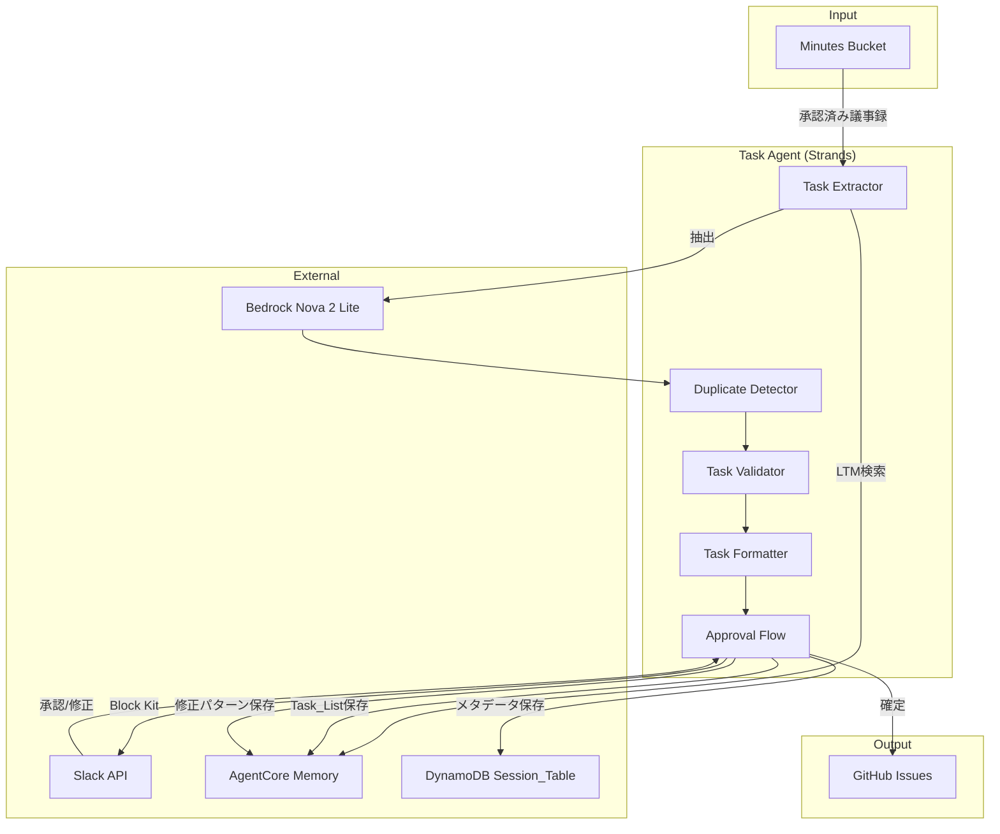

# タスク抽出機能 設計

## 概要

承認済み議事録からタスクを自動抽出する機能。Strands Agents SDK + Amazon Bedrock（Nova 2 Lite）でタスクを識別・構造化し、AgentCore Memory で抽出パターンを学習、Slack 確認フローを経て GitHub Issues 登録準備を行う。

## アーキテクチャ



## コンポーネント

| コンポーネント     | ファイル                             | 責務                   |
| ------------------ | ------------------------------------ | ---------------------- |
| Task_Extractor     | `agents/tools/extract_tasks.py`      | 議事録からタスク抽出   |
| Task_Validator     | `agents/tools/task_validator.py`     | タスクの妥当性検証     |
| Task_Formatter     | `agents/tools/task_formatter.py`     | Markdown 変換、ソート  |
| Duplicate_Detector | `agents/tools/duplicate_detector.py` | 重複タスク検出・統合   |
| Approval_Flow      | `agents/tools/task_approval_flow.py` | Slack 承認フロー管理   |
| Task_Persistence   | `agents/tools/task_persistence.py`   | Memory/DynamoDB 永続化 |

## データモデル

### Task（タスク）

```python
class Task(BaseModel):
    id: str                       # タスクID（UUID）
    title: str                    # タイトル（100文字以内）
    description: str              # 説明（議事録からの引用含む）
    assignee: Optional[str]       # 担当者（未定の場合None）
    due_date: Optional[date]      # 期限（未定の場合None）
    priority: Priority            # 優先度（high/medium/low）
    source_quote: str             # 元の議事録の該当箇所

class Priority(str, Enum):
    HIGH = "high"
    MEDIUM = "medium"
    LOW = "low"
```

### TaskList（タスクリスト）

```python
class TaskList(BaseModel):
    session_id: str               # セッションID
    minutes_id: str               # 元の議事録ID
    tasks: List[Task]             # タスクリスト
    status: TaskListStatus        # ステータス（pending/approved/revision_requested/cancelled）
```

### 承認待ちデータの永続化

| データ種別            | 保存先                 | 理由                                    |
| --------------------- | ---------------------- | --------------------------------------- |
| TaskList 本体（JSON） | AgentCore Memory STM   | セッション単位で管理、90 日自動期限切れ |
| 承認状態・メタデータ  | DynamoDB Session_Table | 高速なステータス検索                    |
| 修正パターン          | AgentCore Memory LTM   | セマンティック検索で類似パターンを取得  |

## 重複検出・優先度推定

- **重複検出**: Levenshtein 距離ベースの類似度計算、80%以上で重複とみなす
- **優先度推定**: Nova 2 Lite でキーワード（「至急」「緊急」「今週中」等）を判定

## 正当性プロパティ

### Property 1: タスク構造の完全性

_任意の_ 抽出されたタスクに対して、必須フィールド（title, description, priority, source_quote）が存在し、title は空でない。
**Validates: Requirements 2.1, 2.3**

### Property 2: タスク検証

_任意の_ タスクに対して、タイトル空/100 文字超過/無効な優先度/無効な日付形式の場合は検証失敗する。
**Validates: Requirements 3.1, 3.2, 3.3, 3.4, 3.5**

### Property 3: Markdown 出力形式

_任意の_ TaskList に対して、出力は優先度順（high → medium → low）でソートされ、チェックボックス形式（`- [ ]`）で出力される。
**Validates: Requirements 4.1, 4.2, 4.3, 4.4**

### Property 4: Markdown ラウンドトリップ

_任意の_ 有効な TaskList に対して、`from_markdown(to_markdown(task_list))` が元の TaskList と同等の構造を持つ。
**Validates: Requirements 4.5**

### Property 5: Block Kit 構造の妥当性

_任意の_ TaskList と session_id に対して、生成された Block Kit JSON はタスク一覧プレビュー、承認/修正ボタン、各タスクの削除ボタンを含む。
**Validates: Requirements 5.2**

### Property 6: 承認フロー状態遷移

_任意の_ 承認アクションに対して、approve → APPROVED、request_revision → REVISION_REQUESTED、cancel → CANCELLED を返す。
**Validates: Requirements 5.3, 5.4**

### Property 7: TaskList 操作

_任意の_ TaskList とタスク操作に対して、削除後はそのタスク ID が含まれず、追加後は新しいタスクが含まれる。
**Validates: Requirements 5.5, 5.6**

### Property 8: 類似度閾値

_任意の_ 2 つのタイトルに対して、類似度が 0.8 以上の場合、重複として検出される。
**Validates: Requirements 6.3**

### Property 9: 重複統合

_任意の_ 重複タスクを含む TaskList に対して、統合後は重複が存在せず、より詳細な説明を持つ方の内容を保持する。
**Validates: Requirements 6.1, 6.2, 6.4**

### Property 10: リトライ動作

_任意の_ 失敗する操作に対して、最大 3 回のリトライが行われ、指数バックオフが適用される。
**Validates: Requirements 7.1**

### Property 11: 承認待ち TaskList の永続化ラウンドトリップ

_任意の_ 承認待ち TaskList に対して、`load_pending_tasks(save_pending_tasks(task_list))` が元の TaskList と同等の構造を持つ。
**Validates: Requirements 8.4**

## エラーハンドリング

| エラー種別             | 対応                   | リトライ  |
| ---------------------- | ---------------------- | --------- |
| タスクなし             | 空の TaskList を返す   | なし      |
| タイトル空/超過        | ValidationError を返す | なし      |
| 無効な優先度/日付      | ValidationError を返す | なし      |
| Bedrock API エラー     | リトライ後 Slack 通知  | 最大 3 回 |
| Memory/DynamoDB エラー | ログ記録、処理継続     | 最大 3 回 |

## テスト戦略

- **ユニットテスト**: Validator、Formatter、DuplicateDetector のロジック検証
- **プロパティベーステスト**: Hypothesis（Python）、最小 100 回/プロパティ

### テストファイル構成

```
tests/
├── unit/
│   ├── test_task_validator.py
│   ├── test_task_formatter.py
│   ├── test_duplicate_detector.py
│   └── test_task_approval_flow.py
├── property/
│   ├── test_task_structure.py        # Property 1
│   ├── test_task_validation.py       # Property 2
│   ├── test_markdown_roundtrip.py    # Property 4
│   ├── test_similarity.py            # Property 8
│   ├── test_duplicate_merge.py       # Property 9
│   └── test_persistence_roundtrip.py # Property 11
└── integration/
    └── test_task_extraction_e2e.py
```
