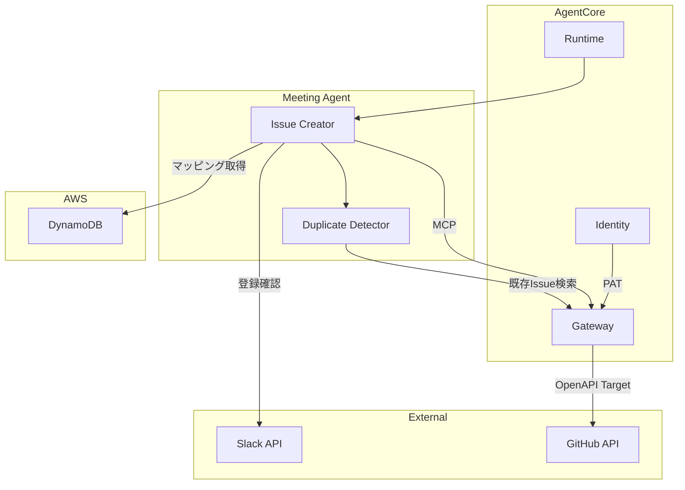

# GitHub 連携機能 設計

## 概要

AgentCore Gateway 経由で GitHub REST API に接続し、承認済みタスクを GitHub Issues として自動登録する機能。Strands Agents SDK でツールを実装し、Slack での最終確認フローを経て Issue を作成する。

## アーキテクチャ



## コンポーネント

| コンポーネント     | ファイル                                         | 責務                           |
| ------------------ | ------------------------------------------------ | ------------------------------ |
| Issue_Creator      | `agents/tools/github_issue.py`                   | タスクから Issue を作成        |
| Issue_Formatter    | `agents/tools/issue_formatter.py`                | Issue 本文のフォーマット       |
| Duplicate_Detector | `agents/tools/duplicate_detector.py`             | 重複 Issue の検出              |
| Assignee_Mapper    | `agents/tools/assignee_mapper.py`                | 担当者名 → GitHub ユーザー変換 |
| Milestone_Selector | `agents/tools/milestone_selector.py`             | 期限に基づくマイルストーン選択 |
| GitHub_Construct   | `lib/constructs/integration/github-construct.ts` | Gateway Target 設定            |

## データモデル

### Task（入力）

```python
class Task(BaseModel):
    title: str                    # タスクタイトル（100文字以内）
    description: str              # タスクの説明
    assignee: Optional[str]       # 担当者名（「未定」の場合あり）
    due_date: Optional[str]       # 期限（「未定」の場合あり）
    priority: Priority            # 優先度（high/medium/low）
    source_minutes_url: str       # 元の議事録URL
```

### IssueResult（作成結果）

```python
class IssueResult(BaseModel):
    task_title: str               # 元のタスクタイトル
    success: bool                 # 成功/失敗
    issue_url: Optional[str]      # 作成された Issue の URL
    issue_number: Optional[int]   # Issue 番号
    error_message: Optional[str]  # エラーメッセージ（失敗時）
```

### AssigneeMapping（DynamoDB）

| 属性名       | 型     | 説明              |
| ------------ | ------ | ----------------- |
| display_name | String | 表示名（PK）      |
| github_user  | String | GitHub ユーザー名 |

### Gateway Target 設定

- **OpenAPI スキーマ**: `issues.create`, `issues.list`, `labels.create`, `milestones.list` を定義
- **認証**: `Authorization: Bearer ${GITHUB_PAT}` ヘッダー

## 正当性プロパティ

### Property 1: トークンのログ出力防止

_任意の_ ログ出力操作に対して、GitHub Personal Access Token が平文で含まれていない。
**Validates: Requirements 1.6**

### Property 2: Issue 本文ラウンドトリップ

_任意の_ 有効な Task に対して、`parse_issue_body(format_issue_body(task))` が元のタスクと同等の情報を持つ。
**Validates: Requirements 2.2, 2.3, 2.4, 9.1, 9.2, 9.3, 9.4**

### Property 3: 優先度からラベルへのマッピング

_任意の_ Priority 値に対して、`priority: {priority.value}` 形式のラベル文字列を返す。
**Validates: Requirements 3.1, 3.2, 3.3, 3.4**

### Property 4: 担当者マッピング

_任意の_ 担当者名に対して、マッピングが存在する場合は GitHub ユーザー名を返し、存在しない場合は None を返す。
**Validates: Requirements 4.1, 4.2, 4.3, 4.4**

### Property 5: マイルストーン選択

_任意の_ 期限とマイルストーンリストに対して、期限以降で最も近いマイルストーンが選択される。
**Validates: Requirements 5.1, 5.2, 5.3**

### Property 6: Issue 登録確認メッセージ構造

_任意の_ Task に対して、生成された Block Kit JSON は header, section（プレビュー）, actions（登録/キャンセルボタン）を含む。
**Validates: Requirements 6.2**

### Property 7: 完了メッセージの Issue URL 含有

_任意の_ IssueResult（成功）に対して、生成された完了メッセージは Issue URL を含む。
**Validates: Requirements 6.5**

### Property 8: 一括作成の完全性

_任意の_ Task リストに対して、結果は入力タスク数と同じ数の IssueResult を含む。
**Validates: Requirements 7.1, 7.2**

### Property 9: 登録結果サマリー構造

_任意の_ IssueResult リストに対して、サマリーは成功数、失敗数、各 Issue の URL またはエラーメッセージを含む。
**Validates: Requirements 7.5**

### Property 10: リトライ動作

_任意の_ 失敗する GitHub API 操作に対して、最大 3 回のリトライが行われ、指数バックオフが適用される。
**Validates: Requirements 8.1**

### Property 11: エラーログ記録

_任意の_ エラーが発生した操作に対して、エラー内容がログに記録され、トークンは含まれない。
**Validates: Requirements 8.3, 1.6**

### Property 12: タイトル類似度計算

_任意の_ 2 つのタイトル文字列に対して、類似度は 0.0〜1.0 の範囲で、同一文字列の場合は 1.0 を返す。
**Validates: Requirements 10.2**

### Property 13: 重複警告メッセージ構造

_任意の_ 重複 Issue 情報に対して、Block Kit JSON は警告メッセージ、既存 Issue へのリンク、「それでも登録」「スキップ」ボタンを含む。
**Validates: Requirements 10.3, 10.4**

## エラーハンドリング

| エラー種別          | 原因               | 対応                 | リトライ  |
| ------------------- | ------------------ | -------------------- | --------- |
| InvalidTokenError   | トークン無効       | エラー通知、処理中断 | なし      |
| PermissionError     | リポジトリ権限なし | 権限エラー通知       | なし      |
| RateLimitError      | レート制限         | 指数バックオフ       | 最大 3 回 |
| GitHubAPIError      | その他 API エラー  | ログ記録、リトライ   | 最大 3 回 |
| DuplicateIssueError | 重複 Issue 検出    | Slack で確認         | なし      |

## テスト戦略

- **ユニットテスト**: Formatter、Mapper、Detector の各メソッド検証
- **プロパティベーステスト**: Hypothesis（Python）、最小 100 回/プロパティ

### テストファイル構成

```
tests/
├── unit/
│   ├── test_issue_formatter.py
│   ├── test_assignee_mapper.py
│   ├── test_milestone_selector.py
│   └── test_duplicate_detector.py
├── property/
│   ├── test_issue_roundtrip.py        # Property 2
│   ├── test_priority_mapping.py       # Property 3
│   ├── test_assignee_mapping.py       # Property 4
│   ├── test_milestone_selection.py    # Property 5
│   ├── test_batch_creation.py         # Property 8
│   └── test_similarity.py             # Property 12
└── integration/
    └── test_github_e2e.py
```
